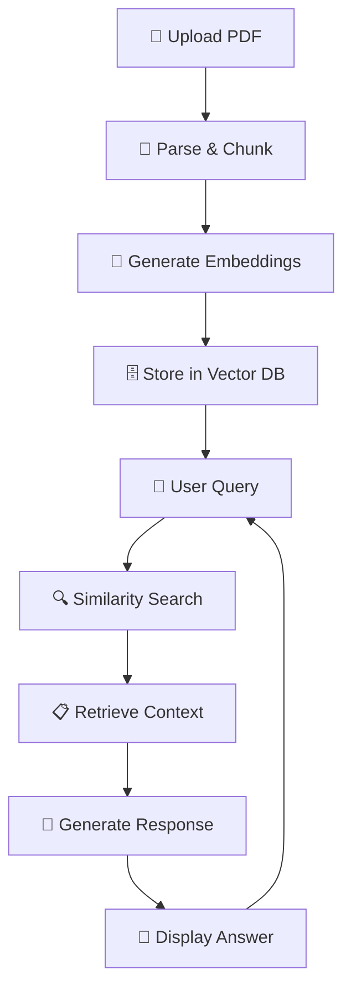

# 🤖 SudoTalk - RAG-based PDF Assistant


## 📖 **Project Overview**

SudoTalk is an intelligent Retrieval-Augmented Generation (RAG) system built with Streamlit that allows users to upload PDF documents and have interactive conversations about their content. The application uses advanced AI technologies to understand document context and provide accurate, contextual responses.

## ✨ **Key Features**

- 📄 **PDF Document Upload & Processing** - Seamless PDF parsing and chunking
- 🔍 **Semantic Search** - Find relevant content across document chunks
- 💬 **Interactive Chat Interface** - Natural conversation with your documents
- 🎯 **Context-Aware Responses** - AI answers based on document content
- 📊 **Session Statistics** - Track your questions and interactions
- 🗑️ **Chat History Management** - Clear or reset conversations
- ⚡ **Real-time Processing** - Live feedback and status indicators
- 🔒 **Secure Document Handling** - Automatic temporary file cleanup

## 🏗️ **Architecture & Components**

### **Core Components:**

```
📁 app/
├── 🌐 main.py              # Streamlit Web Interface
├── 🗄️ VectorDB.py          # Vector Database Management
├── 📄 indexing.py          # Document Processing Pipeline
├── 🔍 retreival.py         # Query Processing & Context Retrieval
├── 🤖 llm.py               # Language Model Integration
└── 📝 system_prompt.py     # Prompt Engineering
```

1. **`main.py`** - Streamlit Web Interface
   - User-friendly web application with PDF upload functionality
   - Chat interface for document-based conversations
   - Session management and state handling
   - Real-time feedback and status indicators

2. **`VectorDB.py`** - Vector Database Management
   - Qdrant vector database integration
   - HuggingFace embeddings (sentence-transformers/all-mpnet-base-v2)
   - Document storage and similarity search capabilities
   - Automatic database initialization and collection management

3. **`indexing.py`** - Document Processing Pipeline
   - PDF document loading and parsing (PyPDFLoader)
   - Text chunking with RecursiveCharacterTextSplitter (1000 chars, 300 overlap)
   - Document vectorization and storage
   - Temporary file handling and cleanup

4. **`retreival.py`** - Query Processing & Context Retrieval
   - Semantic search for relevant document chunks
   - Context preparation for LLM prompts
   - Integration with chat session management

5. **`llm.py`** - Language Model Integration
   - Google Gemini 2.5 Flash model integration
   - Configurable temperature and token settings
   - Query processing and response generation

6. **`system_prompt.py`** - Prompt Engineering
   - Dynamic system prompt generation with document context
   - Metadata and source attribution
   - Context formatting for optimal LLM performance

## 🛠️ **Technology Stack**

| Component | Technology |
|-----------|------------|
| **Frontend** | Streamlit (Interactive web interface) |
| **Vector Database** | Qdrant (Document storage and similarity search) |
| **LLM** | Google Gemini 2.5 Flash (Text generation) |
| **Embeddings** | HuggingFace Sentence Transformers |
| **PDF Processing** | PyPDF + LangChain document loaders |
| **Text Processing** | LangChain text splitters |
| **Environment** | Python 3.13+ with UV package management |

## 🔄 **Workflow Process**



1. **Document Upload**: User uploads a PDF through Streamlit interface
2. **Document Processing**: PDF is parsed, split into chunks, and vectorized
3. **Vector Storage**: Document chunks stored in Qdrant vector database
4. **Query Processing**: User asks questions about the document
5. **Context Retrieval**: Relevant document chunks retrieved via similarity search
6. **Response Generation**: LLM generates contextual responses using retrieved content
7. **Interactive Chat**: Continuous conversation with document context

## 🚀 **Quick Start**

### **Prerequisites**

- Python 3.13+
- UV package manager
- Qdrant database (local or cloud)
- Google AI API key
- HuggingFace API token

### **Installation**

1. **Clone the repository**
   ```bash
   git clone <repository-url>
   cd SudoTalk
   ```

2. **Install dependencies**
   ```bash
   uv sync
   ```

3. **Set up environment variables**
   Create a `.env` file in the root directory:
   ```env
   QDRANT_CLIENT=<your-qdrant-url>
   GOOGLE_API_KEY=<your-google-ai-api-key>
   HUGGINGFACEHUB_API_TOKEN=<your-huggingface-token>
   ```

4. **Run the application**
   ```bash
   cd app
   streamlit run main.py
   ```

### **Usage**

1. 📤 **Upload PDF**: Choose a PDF file using the file uploader
2. ⏳ **Wait**: Let the system process and index your document
3. 💬 **Chat**: Ask questions about your document content
4. 📚 **Explore**: Continue the conversation to dive deeper into topics

## 🎯 **Use Cases**

- **📚 Document Q&A**: Ask questions about uploaded PDFs
- **🔬 Research Assistance**: Quickly find information in large documents
- **📖 Study Aid**: Interactive learning from textbooks and papers
- **📊 Document Analysis**: Extract insights from reports and manuals
- **📝 Content Summarization**: Get key information from lengthy documents

## 🔧 **Configuration**

### **Vector Database Settings**
- **Embedding Model**: `sentence-transformers/all-mpnet-base-v2`
- **Vector Size**: 768 dimensions
- **Distance Metric**: Cosine similarity
- **Collection**: `rag-24`

### **Text Chunking Parameters**
- **Chunk Size**: 1000 characters
- **Chunk Overlap**: 300 characters
- **Splitter**: RecursiveCharacterTextSplitter

### **LLM Configuration**
- **Model**: Google Gemini 2.5 Flash
- **Temperature**: 0 (deterministic responses)
- **Max Retries**: 2

## 📁 **Project Structure**

```
SudoTalk/
├── 📄 README.md                 # Project documentation
├── ⚙️ pyproject.toml            # Project configuration
├── 🔒 uv.lock                   # Dependency lock file
├── 📁 app/                      # Application source code
│   ├── 🌐 main.py               # Streamlit interface
│   ├── 🗄️ VectorDB.py           # Vector database management
│   ├── 📄 indexing.py           # Document processing
│   ├── 🔍 retreival.py          # Context retrieval
│   ├── 🤖 llm.py                # Language model integration
│   └── 📝 system_prompt.py      # Prompt engineering
└── 📁 __pycache__/              # Python cache files
```

## 🏭 **Production Considerations**

- **Environment Variables**: Secure API key management
- **Error Handling**: Comprehensive error catching and user feedback
- **Session Management**: Multi-user state handling
- **File Cleanup**: Automatic temporary file removal
- **Scalability**: Modular architecture for easy scaling
- **Security**: Safe file handling and input validation

## 🤝 **Contributing**

1. Fork the repository
2. Create a feature branch
3. Make your changes
4. Add tests if applicable
5. Submit a pull request

## 📄 **License**

This project is open source. Please check the license file for details.

## 🙋‍♂️ **Support**

If you have questions or need help:
- Check the documentation
- Open an issue on GitHub
- Contact the development team

---

**Made with ❤️ using Streamlit | Powered by AI**